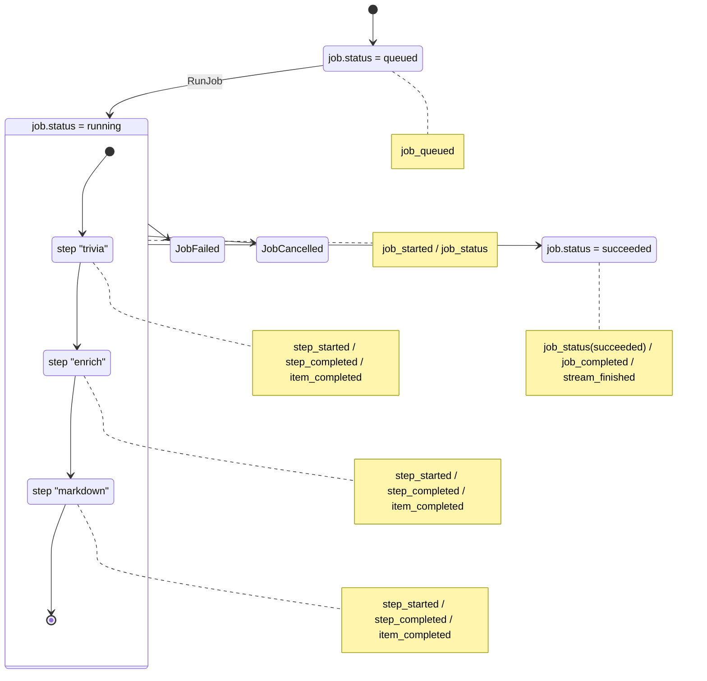

# Pipeline Status Flow

下図は `openai.funmarkdown.v1` のような 3 ステップ構成パイプラインが実行される際のステータス変化を表しています。`Job` ステータスと各 `StepExecution` の遷移を対で示し、`stream=true` のストリーミングイベントがどのタイミングで発生するかもメモしています。

- `JobQueued` → `JobRunning`：`RunJob` が呼ばれ、`job_started` と最新 `job_status` が送出されます。
- 各ステップ（trivia → enrich → markdown）は `step_started` → `step_completed` を発火し、`Export=true` のため `item_completed` で途中結果を配信します。
- 全ステップが `success` になると `job_status`(succeeded) と `job_completed`、そして終端を示す `stream_finished` が送出されます。
- エラー / キャンセル時は `job_failed` / `job_cancelled` とともに `stream_finished` が届き、該当ステップにも `step_failed` / `step_cancelled` が送出されます。
