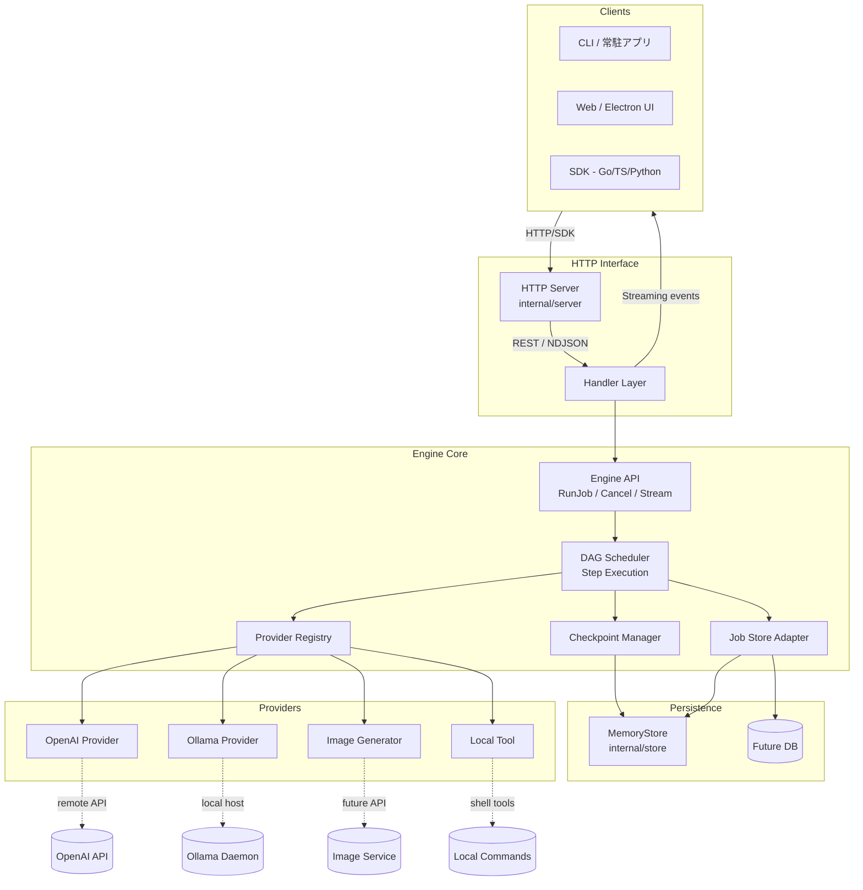

# Pipeline Engine System Diagram

本ファイルでは、Pipeline Engine の主要コンポーネントと内部データフローを簡潔に図解します。

- **Clients**: CLI、Web UI、SDK などが HTTP サーバーを介してジョブを発行 / 監視。
- **HTTP Interface**: `internal/server` の handler が REST/NDJSON API を提供し、Engine Core に処理を委譲。
- **Engine Core**: DAG スケジューラが StepDefinition に従って実行し、ProviderRegistry で選択したプロバイダに処理を依頼。StepCheckpoint や JobStore を介して状態を保持。
- **Providers**: OpenAI/Ollama/画像生成/ローカルツールなどに抽象化された呼び出しポイント。実際の外部 API またはローカルコマンドへ接続。
- **Persistence**: 現在はインメモリストア（MemoryStore）、将来は永続 DB へ差し替え予定。

この図をベースに、ドキュメントや README からリンクすることでシステム全体の把握が容易になります。
